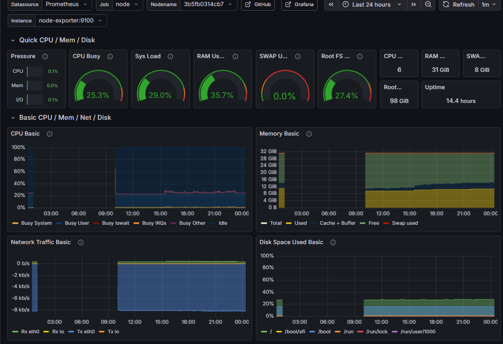

# 🏠 Personal Home Lab Infrastructure

> A containerized, self-hosted Linux server environment focusing on infrastructure monitoring, secure remote access, and utility services.

## 📖 Overview
This repository contains the **Infrastructure-as-Code (IaC)** configurations for my home lab. The setup is designed for high availability and observability, utilizing **Docker Compose** for orchestration and **Prometheus/Grafana** for real-time system insights.

## 🏗 Core Infrastructure

### 🛡 Secure Remote Access (ZeroTier)
To maintain security without exposing ports to the public internet, I use a self-hosted **ZeroTier** node. 
* **Networking:** Operates in `host` mode for seamless integration.
* **Security:** Configured with `NET_ADMIN` capabilities to manage virtual network interfaces securely.

### 📊 Monitoring & Observability Stack
A comprehensive monitoring pipeline to track system health and container performance:
* **Prometheus:** Core time-series database scraping metrics every 15s.
* **Node Exporter:** Collects hardware-level metrics (CPU, RAM, Disk I/O).
* **Alertmanager:** Integrated for proactive system notifications.
* **Grafana:** Visualization layer with persistent data storage and automated provisioning of data sources.

### 🛠 Utility & Application Services
* **Stirling-PDF:** A local, web-based PDF manipulation suite for privacy-conscious document handling.
* **StarTechnology (Minecraft):** A performance-optimized Java-based game server environment (Eclipse Temurin JRE) with managed memory limits (12GB) and automated graceful shutdown procedures.

## ⚙️ System Engineering & Reliability

Since this lab runs on a **Dell Optiplex 3070**, I implemented specific OS-level configurations to handle power management and system stability without dedicated server-grade hardware.

### 🔌 Power Management & Automation
To optimize energy consumption, the server follows a strict automated power cycle:
* **Automation:** A `systemd timer` triggers a shutdown every day at 01:00 AM.
* **Wake-on-LAN / RTC:** The system is configured to boot back up at 09:00 AM.
* **Hardware Note:** Deep Sleep mode is intentionally disabled to ensure reliable wake-up cycles and remote accessibility.

### 🛡️ Resilience & Watchdog Implementation
To ensure 16/7 availability of the services (especially the monitoring and VPN nodes), I implemented a multi-layered failover strategy:
* **Software Watchdog:** Due to the lack of a hardware watchdog on the Optiplex 3070, a software-based watchdog monitors system activity. It triggers a hard reboot after 15 seconds of kernel inactivity.
* **Kernel Panic Handling:** Optimized kernel parameters for automated recovery:
    * `kernel.softlockup_panic=1`: Forces a panic on soft lockups.
    * `kernel.panic=10`: Ensures the system automatically reboots 10 seconds after a panic occurs.

## 📊 Dashboard Insights
I use the **"Node Exporter Full"** dashboard (by rfmoz) to visualize the health of my infrastructure.



As seen in the metrics, the dashboard clearly reflects the daily power cycle (the gap between 01:00 and 09:00), verifying that the power management scripts are executing as intended while maintaining a stable ~35% RAM utilization during operational hours.

## 📂 Project Structure
```text
├── prometheus_grafana.yml  # Monitoring stack (Prometheus, Grafana, Node Exporter)
├── zerotier.yml            # VPN & Secure Tunneling
├── stirling_pdf.yml        # Document Processing Utility
├── startech.yml            # Java-based Game Server Infrastructure
└── prometheus_config/      # Scrape configs and alerting rules

